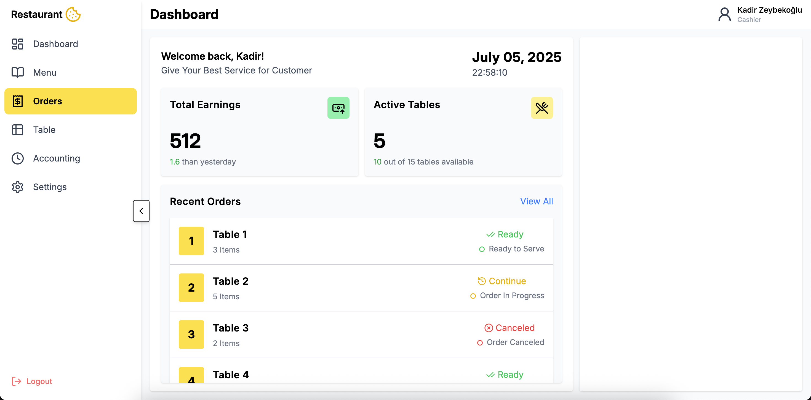

# 🍽️ Web-Based Restaurant POS System

**Web-Based Restaurant POS System** is a modern Point of Sale (POS) solution designed to simplify order, table, menu, and user management in restaurants. The system supports flexible usage with cashier and admin roles.

## 🛠️ Technologies

- **Frontend**: React.js + TailwindCSS  
- **Backend**: Node.js + Express  
- **Database**: MySQL

## 🚀 Features

### 👨‍🍳 Waiter Module
- Table selection and opening
- Adding, deleting, and updating orders
- Product notes and quantity adjustments
- Real-time status tracking (preparing, ready, etc.)

### 💰 Cashier Module
- List of active tables
- Order totals and payment processing
- Viewing order status
- Daily sales and transaction reports

### 🧑‍💼 Admin Panel
- Menu management (add, delete, update products)
- Category and price settings
- Role-based user management
- System-wide statistics and analytics

## 📸 Screenshots

| Cashier Home Page |
|-------------------|
|  |

## 🔧 Installation

```bash
# Clone the project
git clone https://github.com/your-username/web-based-restaurant-pos-system.git

# Navigate to the frontend directory
cd restaurant_POS_front

# Install dependencies
npm install

# Start the development server
npm run dev

